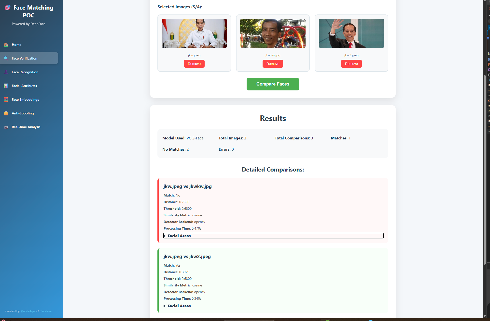

# Face Matching POC 🎯

**Created by [@andi_fni](https://github.com/andi-fajar) & [Claude.ai](https://claude.ai)**

A fun proof-of-concept application for face matching using React frontend and FastAPI backend with DeepFace library. Built as an exploration into modern face recognition technologies!




## Features

- Upload up to 4 images via drag-and-drop
- Choose from multiple face recognition models (VGG-Face, FaceNet, ArcFace, etc.)
- Real-time image preview
- Face comparison with confidence scores
- Comprehensive JSON results display
- Error handling and validation

## Architecture

### Backend (FastAPI + DeepFace)
- FastAPI web framework for REST API
- DeepFace library for face recognition
- Support for 9 different face recognition models
- File upload and image processing
- Model preloading for production performance
- CORS configuration for frontend communication

### Frontend (React + TypeScript)
- React application with TypeScript
- react-dropzone for file upload
- Axios for API communication
- Responsive design with CSS Grid/Flexbox

## Setup and Installation

### Quick Start

For detailed AWS deployment instructions, see **[DEPLOYMENT.md](DEPLOYMENT.md)**

### Method 1: Docker Deployment (Recommended)

1. **Prerequisites**: Docker and Docker Compose installed

2. **Build and run with Docker Compose**:
   ```bash
   docker-compose up --build
   ```

3. **Access the application**:
   - Frontend: `http://localhost:3000`
   - Backend API: `http://localhost:8000`
   - Backend Health Check: `http://localhost:8000/health`

4. **Stop the application**:
   ```bash
   docker-compose down
   ```

### Method 2: Local Development

#### Backend Setup

1. Navigate to the backend directory:
   ```bash
   cd backend
   ```

2. Create and activate virtual environment:
   ```bash
   python -m venv venv
   source venv/bin/activate  # On Windows: venv\Scripts\activate
   ```

3. Install Python dependencies:
   ```bash
   pip install -r requirements.txt
   ```

4. Run the FastAPI server:
   ```bash
   python main.py
   ```

   The API will be available at `http://localhost:8000`

#### Frontend Setup

1. Navigate to the frontend directory:
   ```bash
   cd frontend
   ```

2. Install Node.js dependencies:
   ```bash
   npm install
   ```

3. Start the React development server:
   ```bash
   npm start
   ```

   The application will be available at `http://localhost:3000`

## Available Face Recognition Models

- VGG-Face
- FaceNet
- FaceNet512
- OpenFace
- DeepFace
- DeepID
- ArcFace
- Dlib
- SFace

## API Endpoints

### GET /models
Returns list of available face recognition models.

### GET /health
Returns application health status and model loading information.

### POST /compare-faces
Compares faces in uploaded images.

**Parameters:**
- `files`: List of image files (2-4 images)
- `model`: Selected face recognition model

**Response:**
```json
{
  "model_used": "VGG-Face",
  "total_images": 3,
  "total_comparisons": 3,
  "comparisons": [
    {
      "image1": "photo1.jpg",
      "image2": "photo2.jpg",
      "verified": true,
      "distance": 0.23,
      "threshold": 0.68,
      "model": "VGG-Face",
      "confidence": 66.18
    }
  ],
  "summary": {
    "matches": 1,
    "no_matches": 2,
    "errors": 0
  }
}
```

## Docker Configuration

### Services
- **backend**: FastAPI application with DeepFace models
- **frontend**: React application served by nginx

### Volumes
- **deepface_models**: Persistent storage for downloaded face recognition models

### Networks
- **face-match-network**: Bridge network for service communication

### Health Checks
- Backend: Checks `/health` endpoint
- Frontend: Checks nginx availability

## Usage

1. Start the application (Docker or local development)
2. Open `http://localhost:3000` in your browser
3. Select a face recognition model from the dropdown
4. Drag and drop 2-4 images or click to select files
5. Click "Compare Faces" to process the images
6. View detailed results including match status and confidence scores

## Deployment

### Local Development
```bash
docker-compose up --build
```

### AWS Production Deployment
For production deployment on AWS EC2 or ECS, see the comprehensive guide:

**📖 [DEPLOYMENT.md](DEPLOYMENT.md)** - Complete AWS deployment instructions

#### Quick Overview:
- **EC2 + Docker Compose**: Simple, cost-effective (~$75/month)
- **ECS Fargate**: Managed, auto-scaling (~$100/month)  
- **ECS on EC2**: Hybrid approach, customizable

#### Minimum Requirements:
- **Instance**: t3.large (4GB RAM, 2 vCPUs)
- **Storage**: 20-30 GB
- **Network**: VPC with internet gateway

## Production Considerations

### Model Preloading
- All models are preloaded during application startup
- First-time model downloads are cached in persistent volumes
- Eliminates cold start latency for face comparisons

### Performance Optimizations
- Multi-stage Docker builds for smaller image sizes
- nginx caching and compression for frontend assets
- Health checks for service monitoring
- Persistent model storage to avoid re-downloads

### Security Features
- CORS configuration
- File type validation
- Request size limits
- Security headers in nginx

## Dependencies

### Backend
- fastapi==0.104.1
- uvicorn==0.24.0
- deepface==0.0.93
- opencv-python==4.10.0.84
- tensorflow>=2.16.0
- tf-keras
- numpy<2.0

### Frontend
- React 18+
- TypeScript
- axios
- react-dropzone

## Notes

- The application uses temporary files for processing and automatically cleans them up
- Face detection is optional (enforce_detection=False) to allow comparison even if faces are not clearly detected
- All uploaded images are validated for proper image format
- Model weights are persisted in Docker volumes to avoid re-downloading
- TensorFlow compatibility is ensured with legacy Keras configuration

## Credits & Acknowledgments 🙏

This project was created as a collaborative effort between:

- **[@andi-fajar](https://github.com/andi-fajar)** - Project creator and developer
- **[Claude.ai](https://claude.ai)** - AI assistant for code development and architecture

### Special Thanks

- **[DeepFace](https://github.com/serengil/deepface)** - For the amazing open-source face recognition library
- **FastAPI** - For the modern, fast web framework
- **React** - For the frontend framework
- **Docker** - For containerization capabilities

---

*This is a fun experimental project showcasing modern face recognition capabilities. Feel free to explore, learn, and build upon it!* 🚀